# PRESENTACION — MIS PROYECTOS DE INTELIGENCIA ARTIFICIAL Y AUTOMATIZACION

## Harol Benjamin Medina Zarate
### Agentes IA · Automatizacion · RAG · n8n · Python · QA

---

## Indice de Proyectos

| # | Proyecto | Repo | Tecnologias |
|---|----------|------|-------------|
| 1 | Software Archaeologist | [Agentes_Especializado](https://github.com/Harol-Medina/Agentes_Especializado) | Python, FastAPI, Java, Spring Boot, Next.js, Amazon Bedrock, pgvector, Docker |
| 2 | Enterprise AI Knowledge Agent | [Enterprise_AI_Knowledge_Agent](https://github.com/Harol-Medina/Enterprise_AI_Knowledge_Agent) | Python, FastAPI, Cohere, ChromaDB, React, pytest, Docker |
| 3 | DataLens AI — Analisis de datos con agentes | [Automatizando_analisis_datos_agentes](https://github.com/Harol-Medina/Automatizando_analisis_datos_agentes) | Python, LangChain, Groq, Streamlit, Pandas |
| 4 | Essay AI Agent — Orquestacion multiagente | [Orquestacion_agentes_multiagentes](https://github.com/Harol-Medina/Orquestacion_agentes_multiagentes) | Python, LangGraph, Gemini, Tavily, Gradio |
| 5 | Agente de Investigacion con LangGraph | [Agentes_IA_LangGraph](https://github.com/Harol-Medina/Agentes_IA_LangGraph) | Python, LangGraph, Gemini, Tavily, arXiv, Gradio |
| 6 | RAG con Agentes IA | [RAG_Agentes_IA](https://github.com/Harol-Medina/RAG_Agentes_IA) | Python, LangChain, LangGraph, Gemini, FAISS |
| 7 | Agente RAG en Telegram (n8n) | [n8n](https://github.com/Harol-Medina/n8n) | n8n, Telegram, Cohere, Vector Store, MySQL |
| 8 | Automatizacion Code Review con GitHub (n8n) | [n8n](https://github.com/Harol-Medina/n8n) | n8n, GitHub, JavaScript, Slack, Gmail, Google Sheets |
| 9 | IA Aplicada — Integracion de LLMs | [IA_Aplicada](https://github.com/Harol-Medina/IA_Aplicada) | Python, Gemini API, Groq API, Pandas |

---
---

## PROYECTO 1: Software Archaeologist

**Repo:** [github.com/Harol-Medina/Agentes_Especializado](https://github.com/Harol-Medina/Agentes_Especializado)

---

### Que es

Plataforma que analiza **automaticamente repositorios de software** usando un pipeline de 9 agentes IA especializados. Le das una URL de GitHub y el sistema produce: grafos de dependencias interactivos, documentacion arquitectonica, chat RAG sobre el codigo y un plan de modernizacion.

### Problema que resuelve

Analizar un repositorio manualmente (entender arquitectura, buscar codigo muerto, detectar vulnerabilidades, documentar) puede tomar **dias**. Con este sistema toma **minutos**.

### Arquitectura

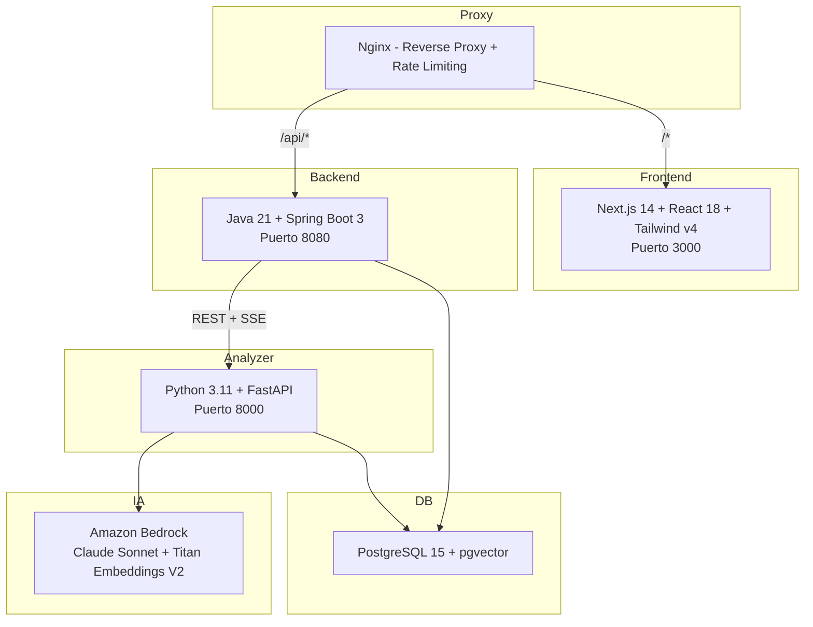

### Pipeline de 9 Agentes IA

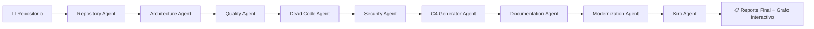

| Agente | Que hace |
|--------|----------|
| **Repository** | Clona el repo, detecta lenguaje/framework, parsea AST, construye grafo de dependencias |
| **Architecture** | Analiza patrones arquitectonicos, capas y violaciones de dependencias |
| **Quality** | Calcula metricas de complejidad y detecta code smells |
| **Dead Code** | Detecta codigo muerto (archivos, funciones, exports sin uso) |
| **Security** | Detecta vulnerabilidades y problemas de seguridad |
| **C4 Generator** | Genera diagramas C4 en formato Mermaid |
| **Documentation** | Genera documentacion tecnica automatica |
| **Modernization** | Propone plan priorizado de refactoring |
| **Kiro** | Transforma el plan en formato Spec nativo de Kiro |

### Funcionalidades principales

- **Chat RAG sobre el codigo**: Preguntas en lenguaje natural sobre el repositorio analizado
- **Grafo interactivo de dependencias**: Visualizacion con react-force-graph-2d
- **Progreso en tiempo real**: SSE (Server-Sent Events) del estado de cada agente
- **Reporte de 8 tabs**: Architecture, Quality, Dead Code, Security, C4, Roadmap, Docs, Plan
- **Cancelacion de jobs**: Desde UI o API, con timeout automatico de 30 min

### Stack tecnologico

| Capa | Tecnologia |
|------|------------|
| Frontend | Next.js 14, React 18, TypeScript, Tailwind CSS v4, shadcn/ui |
| Backend | Java 21, Spring Boot 3, WebFlux, JPA, Flyway |
| Analyzer | Python 3.11+, FastAPI, Tree-sitter (parsing AST) |
| IA/LLM | Amazon Bedrock (Claude Sonnet) |
| Embeddings | Amazon Bedrock (Titan Embed V2) |
| Base de datos | PostgreSQL 15 + pgvector |
| Proxy | Nginx (rate limiting) |
| Contenedores | Docker Compose (5 servicios) |

### Despliegue en AWS

- Elastic Beanstalk (Backend, Analyzer, Frontend)
- RDS PostgreSQL 15 + pgvector
- Amazon Bedrock (Claude + Titan)
- CodeBuild (pre-compilacion)
- CloudWatch (monitoreo)

---
---

## PROYECTO 2: Enterprise AI Knowledge Agent

**Repo:** [github.com/Harol-Medina/Enterprise_AI_Knowledge_Agent](https://github.com/Harol-Medina/Enterprise_AI_Knowledge_Agent)

---

### Que es

Sistema RAG empresarial que permite a colaboradores consultar **documentacion interna** en lenguaje natural. Combina busqueda vectorial semantica, generacion de respuestas con Cohere e interfaz web con historial de conversaciones y control de acceso por roles.

### Problema que resuelve

Los equipos pierden tiempo buscando informacion en documentos internos (manuales, procedimientos, guias). Este agente responde preguntas como:
- "¿Cuanto dura el proceso de onboarding?"
- "¿Cuales son los estandares de ingenieria backend?"
- "¿Como se gestiona un incidente de produccion?"

### Arquitectura

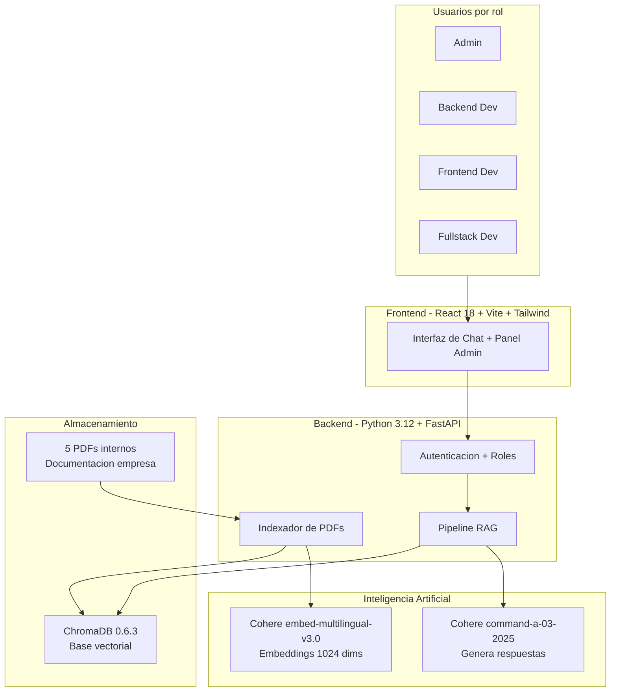

### Funcionalidades

| Funcionalidad | Descripcion |
|---------------|-------------|
| **Chat RAG** | Preguntas en lenguaje natural sobre documentos internos |
| **Control de acceso por roles** | Cada usuario solo ve documentos de su rol |
| **Panel admin** | Estadisticas de uso, gestion de usuarios, subir documentos |
| **Historial de conversaciones** | Mantiene contexto entre preguntas |
| **Busqueda web complementaria** | Tavily como fuente externa opcional |
| **63 pruebas automatizadas (QA)** | pytest + FastAPI TestClient sin API keys |

### QA — 63 tests automatizados

| Grupo de tests | Cantidad |
|----------------|----------|
| Salud y API | 9 |
| Documentos por rol | 6 |
| Consulta RAG | 11 |
| Autenticacion | 5 |
| Historial de chat | 5 |
| Indexacion | 3 |
| Dominio y servicios | 24 |

### Stack

| Capa | Tecnologia |
|------|------------|
| Backend | Python 3.12, FastAPI |
| Chat LLM | Cohere command-a-03-2025 |
| Embeddings | Cohere embed-multilingual-v3.0 |
| Base vectorial | ChromaDB 0.6.3 |
| PDFs | PyPDF2 |
| Frontend | React 18 + Vite + Tailwind CSS |
| QA | pytest + FastAPI TestClient |
| Deploy | Docker + Compose |

---
---

## PROYECTO 3: DataLens AI — Analisis de datos con agentes

**Repo:** [github.com/Harol-Medina/Automatizando_analisis_datos_agentes](https://github.com/Harol-Medina/Automatizando_analisis_datos_agentes)

---

### Que es

Aplicacion web donde **cualquier persona puede analizar datos complejos hablando en lenguaje natural**. Subes un CSV, haces preguntas en espanol y el agente ReAct ejecuta calculos, genera graficos y produce reportes descargables en Word. Sin necesidad de saber Python, SQL ni estadistica.

### Problema que resuelve

Analizar datos normalmente requiere conocimiento tecnico (Python, pandas, SQL). Con DataLens AI, un usuario sin conocimientos tecnicos puede obtener insights simplemente preguntando.

### Como funciona el agente ReAct

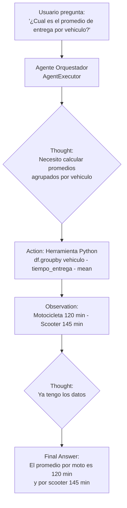

### Arquitectura completa

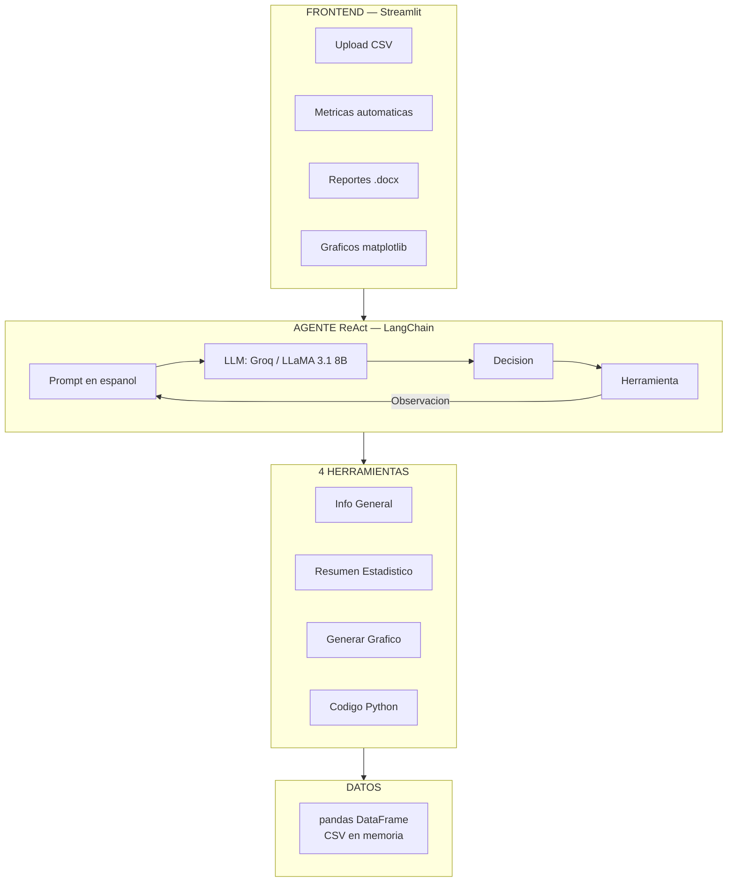

### Las 4 herramientas del agente

| Herramienta | Para que sirve | Ejemplo |
|-------------|----------------|---------|
| **Info General** | Panorama del dataset: columnas, tipos, nulos, duplicados | "Dame un reporte general" |
| **Resumen Estadistico** | Promedios, desviaciones, min/max, detecta outliers | "Estadisticas descriptivas" |
| **Generar Grafico** | Crea visualizaciones con matplotlib/seaborn | "Grafico de barras de entrega por clima" |
| **Codigo Python** | Ejecuta calculos directamente sobre el DataFrame | "¿Cuantos pedidos hay por categoria?" |

### Stack

| Tecnologia | Para que |
|------------|----------|
| Python 3.12 | Lenguaje base |
| LangChain 0.3 | Framework del agente con herramientas |
| Groq Cloud + LLaMA 3.1 8B | Modelo de lenguaje |
| Streamlit 1.44 | Interfaz web |
| Pandas 2.2 | Manipulacion de datos |
| Matplotlib + Seaborn | Graficos |
| python-docx | Reportes descargables en Word |

---
---

## PROYECTO 4: Essay AI Agent — Orquestacion multiagente

**Repo:** [github.com/Harol-Medina/Orquestacion_agentes_multiagentes](https://github.com/Harol-Medina/Orquestacion_agentes_multiagentes)

---

### Que es

Agente que escribe redacciones pasando por un **proceso real de multiples etapas**: planificacion, investigacion, escritura, autocritica y reescritura. Usa LangGraph para orquestar un grafo de estados donde el agente se evalua a si mismo, busca mas informacion y mejora el texto en cada iteracion.

### Problema que resuelve

Demuestra como orquestar **multiples agentes con roles distintos** en un flujo iterativo controlado. El mismo sistema puede aplicarse a: generacion de reportes QA, analisis de documentos, revision de codigo, etc.

### Flujo del grafo LangGraph

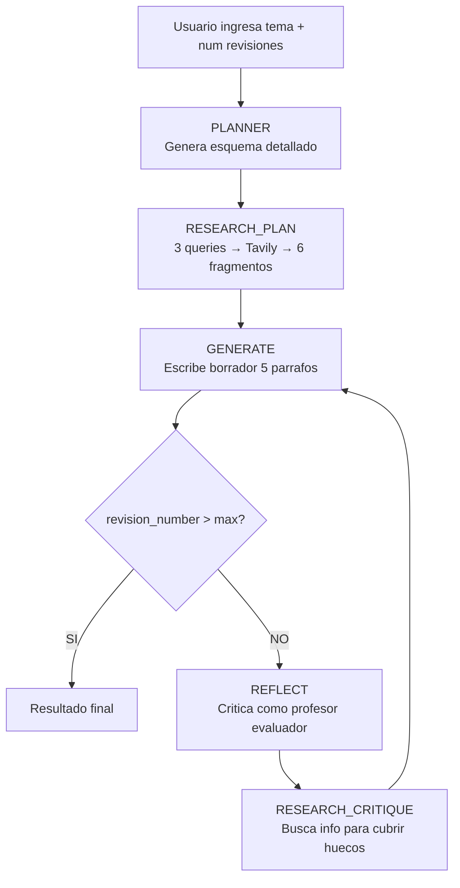

### Los 5 roles del agente

| Nodo | Rol | Que recibe | Que devuelve |
|------|-----|-----------|--------------|
| **PLANNER** | Escritor estratega | El tema | Plan/esquema estructurado |
| **RESEARCH_PLAN** | Investigador | El tema | 6 fragmentos de fuentes reales (Tavily) |
| **GENERATE** | Escritor | Tema + plan + investigacion + critica | Borrador de 5 parrafos |
| **REFLECT** | Profesor evaluador | El borrador | Critica detallada con sugerencias |
| **RESEARCH_CRITIQUE** | Investigador | La critica | Mas fragmentos para cubrir huecos |

### Conceptos clave demostrados

- **LangGraph**: Flujo como grafo de estados (no lineal)
- **Agentes con multiples roles**: Un sistema que cambia de "personalidad" segun la etapa
- **Ciclo iterativo**: Autocritica y mejora continua (configurable de 0 a 5 ciclos)
- **Checkpoints SQLite**: Guarda estado en cada paso — permite retomar, debuggear, rollback
- **Investigacion real**: Tavily Search para datos actuales de internet
- **Interfaz Gradio**: UI web con progreso en tiempo real

### Stack

| Tecnologia | Para que |
|------------|----------|
| Python 3.11+ | Lenguaje base |
| LangGraph | Orquestacion del grafo de agentes |
| Google Gemini Flash | Modelo de lenguaje |
| Tavily | Busqueda web en tiempo real |
| Gradio | Interfaz web |
| SQLite | Checkpoints del grafo |
| Pydantic | Structured output |

---
---

## PROYECTO 5: Agente de Investigacion con LangGraph

**Repo:** [github.com/Harol-Medina/Agentes_IA_LangGraph](https://github.com/Harol-Medina/Agentes_IA_LangGraph)

---

### Que es

Sistema de investigacion automatizada que responde preguntas usando **dos tipos de fuentes**: busqueda web (Tavily) y busqueda cientifica (arXiv). Un router inteligente decide automaticamente que agente debe responder cada pregunta.

### Problema que resuelve

Cuando necesitas investigar un tema, normalmente buscas manualmente en Google y en bases de papers. Este agente decide solo donde buscar y genera una respuesta consolidada.

### Arquitectura del grafo

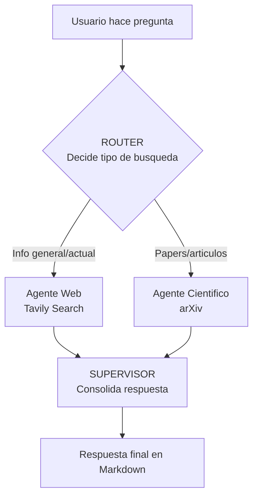

### Conceptos clave

- **Router condicional**: LangGraph decide que camino tomar segun la pregunta
- **Agentes especializados**: Uno para web, otro para papers cientificos
- **Estado compartido**: Todos los nodos leen/escriben un mismo estado
- **Reintentos automaticos**: Maneja errores 503 de Gemini con retry
- **Interfaz Gradio**: UI web para interactuar con el agente

### Stack

| Tecnologia | Para que |
|------------|----------|
| Python 3.10+ | Lenguaje base |
| LangGraph | Grafo de agentes con router |
| LangChain | Framework de IA |
| Google Gemini 2.5 Flash | Modelo de lenguaje |
| Tavily | Busqueda web |
| arXiv API v4 | Busqueda de papers cientificos |
| Gradio | Interfaz web |

---
---

## PROYECTO 6: RAG con Agentes IA

**Repo:** [github.com/Harol-Medina/RAG_Agentes_IA](https://github.com/Harol-Medina/RAG_Agentes_IA)

---

### Que es

Flujo RAG para responder preguntas sobre **politicas internas** de una empresa. Procesa documentos PDF, crea embeddings con Gemini, construye un indice vectorial con FAISS y usa un agente LangGraph que decide si: responde automaticamente, pide mas informacion o abre un ticket.

### Problema que resuelve

Automatizar la consulta de documentacion interna con triaje inteligente: el agente no solo responde, sino que **decide que hacer** con cada consulta.

### Flujo del agente

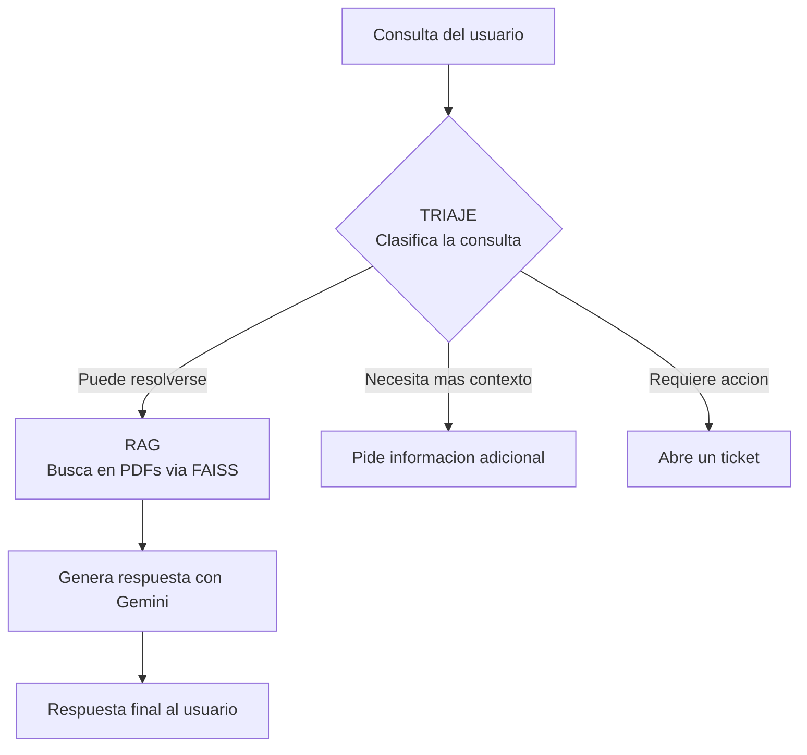

### Pipeline RAG

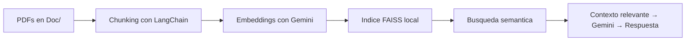

### Stack

| Tecnologia | Para que |
|------------|----------|
| Python | Lenguaje base |
| LangChain | Carga PDFs, chunking, flujo RAG |
| LangGraph | Orquestacion del agente y triaje |
| Google Gemini | LLM + Embeddings |
| FAISS | Indice vectorial local |

---
---

## PROYECTO 7: Agente RAG en Telegram (n8n)

**Repo:** [github.com/Harol-Medina/n8n](https://github.com/Harol-Medina/n8n)

---

### 📸 Captura del flujo

---

### Que es

Agente de IA conversacional desplegado en **Telegram** que responde preguntas usando una base de conocimiento propia. Usa la tecnica RAG: busca informacion en un Vector Store y en MySQL, y genera respuestas con Cohere.

### Diagrama del flujo

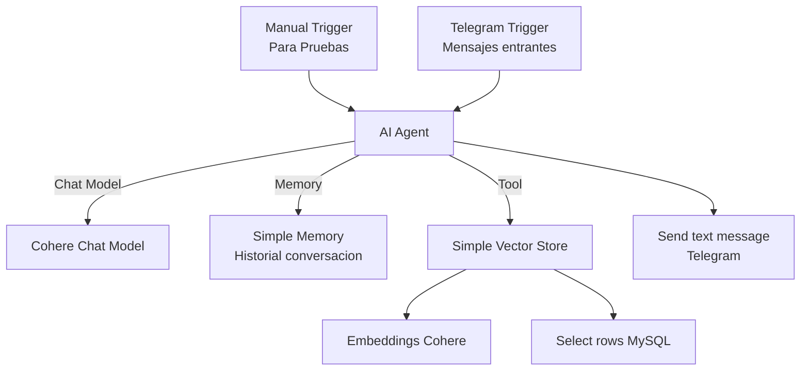

### Componentes

| Nodo | Que hace |
|------|----------|
| **Telegram Trigger** | Escucha mensajes de usuarios. Activa el flujo 24/7. |
| **Manual Trigger** | Para testing sin depender de Telegram. |
| **AI Agent** | Cerebro: decide si buscar en Vector Store, en MySQL o responder directo. |
| **Cohere Chat Model** | Genera respuestas en lenguaje natural. |
| **Simple Memory** | Recuerda conversaciones previas. Mantiene contexto. |
| **Simple Vector Store** | Busca documentos por significado semantico. |
| **Embeddings Cohere** | Convierte texto en vectores para busqueda semantica. |
| **MySQL** | Consulta datos estructurados en tiempo real. |
| **Send text message** | Responde al usuario en Telegram. |

### Resultado

| Sin este agente | Con este agente |
|-----------------|-----------------|
| Buscar en documentos manualmente | Preguntar en Telegram |
| Escribir queries SQL | El agente consulta por ti |
| 10-30 min por consulta | 5-15 segundos |
| Solo disponible en horario laboral | 24/7 |

---
---

## PROYECTO 8: Automatizacion de Code Review con GitHub (n8n)

**Repo:** [github.com/Harol-Medina/n8n](https://github.com/Harol-Medina/n8n)

---

### 📸 Captura del flujo

---

### Que es

Sistema automatizado de **revision de codigo** que se activa con eventos de GitHub. Analiza cambios con IA, notifica por Slack y Gmail, espera respuesta del developer y registra todo en Google Sheets.

### Diagrama del flujo

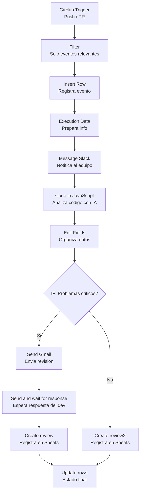

### Componentes

| Nodo | Que hace |
|------|----------|
| **GitHub Trigger** | Detecta push/PR automaticamente |
| **Filter** | Solo procesa eventos relevantes (rama main, ciertos archivos) |
| **Insert Row** | Registra para trazabilidad |
| **Message Slack** | Notifica al canal del equipo |
| **Code in JavaScript** | Analiza el diff con IA, genera revision automatica |
| **IF** | Si hay problemas criticos → ruta email. Si OK → solo registra |
| **Send Gmail** | Envia feedback al developer |
| **Send and wait** | Espera respuesta (aprobacion o correccion) |
| **Create review** | Registra en Google Sheets |
| **Update rows** | Actualiza estado final |

### Resultado

| Sin automatizacion | Con este flujo |
|--------------------|----------------|
| Revisar GitHub periodicamente | Trigger detecta al instante |
| Leer codigo linea por linea | IA analiza en segundos |
| Escribir cada observacion | IA genera la revision |
| Notificar manualmente | Slack + Gmail automatico |
| Anotar en spreadsheet | Google Sheets automatico |
| **15-45 min por PR** | **1-3 minutos** |

---
---

## PROYECTO 9: IA Aplicada — Integracion de LLMs con Python

**Repo:** [github.com/Harol-Medina/IA_Aplicada](https://github.com/Harol-Medina/IA_Aplicada)

---

### Que es

Proyecto de **8 notebooks** que demuestran la integracion practica de IA generativa con Python. Desde conexion basica con APIs hasta un pipeline completo de automatizacion: resumen de correos, clasificacion de sentimiento, respuestas estructuradas en JSON.

### Flujo del proyecto

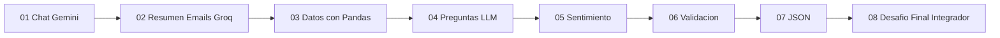

### Cada notebook

| # | Nombre | Que hace | Habilidad |
|---|--------|----------|-----------|
| 01 | Chat Gemini | Conecta con API de Google Gemini | Integracion de LLMs |
| 02 | Resumen Emails | Resumen automatico de correos con Groq | Prompt Engineering |
| 03 | Pandas Tabla | Lectura y exploracion de datos | Preparacion de datos para IA |
| 04 | Preguntas LLM | Generacion batch de respuestas guardadas en archivos | Automatizacion con IA |
| 05 | Sentimiento | Clasificacion automatica de resenas (positivo/negativo/neutro) | NLP con IA generativa |
| 06 | Validacion | Manejo de errores con APIs de IA | QA y robustez |
| 07 | JSON | Respuestas del modelo en formato JSON estructurado | Integracion IA → sistemas |
| 08 | Desafio Final | Pipeline completo: datos + IA + JSON + resumen | Orquestacion end-to-end |

### Stack

| Tecnologia | Para que |
|------------|----------|
| Python | Lenguaje base |
| Google Gemini API | LLM para generacion |
| Groq API | LLM rapido para resumenes |
| Pandas | Manipulacion de datos |
| Jupyter Notebook | Desarrollo interactivo |
| dotenv | Seguridad de API keys |

---
---

## RESUMEN: Que demuestran estos 9 proyectos

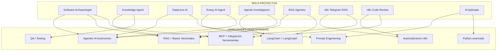

---

## Certificaciones que respaldan estos proyectos

| Certificacion | Entidad | Ano |
|---------------|---------|-----|
| Google AI Professional Certificate | Google / Coursera | 2026 |
| Google Prompting Essentials Certificate | Google / Coursera | 2026 |
| Claude 101 - Certificate of Completion | Anthropic | 2026 |
| AI Fundamentals with IBM SkillsBuild | IBM | 2026 |
| Databricks Fundamentals Accreditation | Databricks Academy | 2026 |
| Python: Inteligencia Artificial Aplicada | Alura Latam | 2026 |
| Oracle Cloud Infrastructure 2025 Foundations | Oracle | 2025 |

---

## Contacto

**Harol Benjamin Medina Zarate**  
ben14mz@gmail.com | +51 927 974 457 | Lima, Peru  
GitHub: [github.com/Harol-Medina](https://github.com/Harol-Medina)  
Disponibilidad: Inmediata | Modalidad: Hibrida
